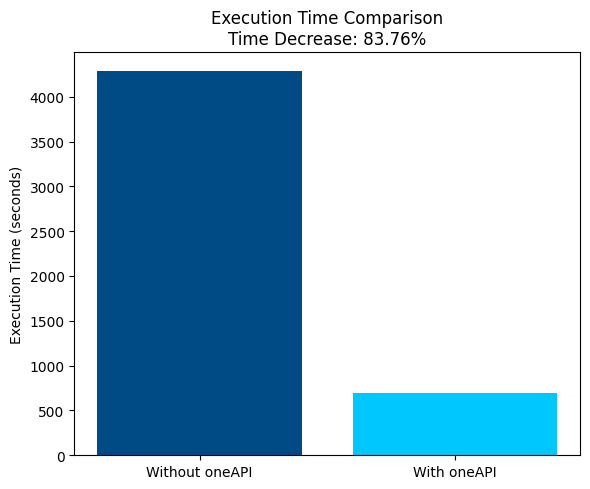
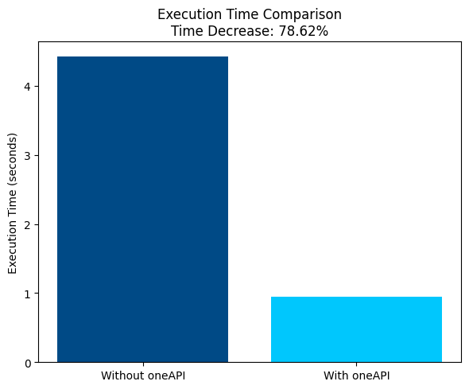
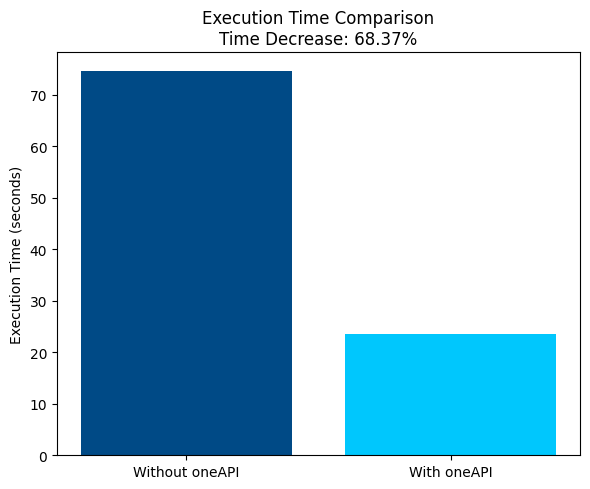

  [![Contributors][contributors-shield]][contributors-url]
  [![Forks][forks-shield]][forks-url]
  [![Stargazers][stars-shield]][stars-url]
  [![Issues][issues-shield]][issues-url]

<!-- PROJECT LOGO -->
 

  

  <h1 align="center">Diagnosify - Neurological Diagnosis Platform</h1>

  

    Welcome to our project!
     
     
    <a href="https://drive.google.com/file/d/1itKq5K-_9NWnvV7kbW4jGxd6lTLQHwen/view?usp=sharing">View Video</a>
    ·
    <a href="https://apps.healthuniverse.com/bhr-rwr-ghi/">View Deployment</a>
  

<!-- TABLE OF CONTENTS -->

  
Table of Contents

  <ol>
    <li>
      <a href="#about-the-project">About the Project</a>
      <ul>
        <li><a href="#inspiration">Inspiration</a></li>
        <li><a href=#social-impact>Social Impact</a></li>
        <li><a href="#built-with">Built With</a></li>
      </ul>
    </li>
    <li>
      <a href="#intel-oneapi">Intel® OneAPI</a>
      <ul>
        <li><a href="#intel-oneapi">Use of oneAPI in our project</a></li>
      </ul>
    </li>
    <li><a href="#what-it-does">What it does</a></li>
    <li><a href="#how-we-built-it">How we built it</a></li>
    <li><a href="#what-we-learned">What we learned</a></li>
    <li><a href="#references-for-datasets">References for datasets</a></li>
  </ol>

<!-- ABOUT THE PROJECT -->
## About The Project

  

Diagnosify is an innovative neurological diagnosis platform that assists medical professionals in diagnosing neurological diseases. In the modern healthcare landscape, early and accurate diagnosis plays a pivotal role in ensuring timely medical interventions and improved patient outcomes. Diagnosify addresses this need by offering a platform that assists medical professionals in brain diagnosing various diseases using advanced machine learning techniques. The project focuses on the classification of diseases such as Brain Tumor, Alzheimer's Disease and Parkinson's Disease. This repository contains the code and resources used to train and deploy the disease classification models.

#### Pioneered the world's first publicly accessible Parkinson's Disease Detector (based on spiral and wave drawings).
#### Intel® oneAPI is used to optimize the models to provide accurate and efficient prediction.
#### All of our models have an accuracy of 94%+.

(<a href="#readme-top">back to top</a>)

### Inspiration 
The inspiration behind the creation of Diagnosify stems from the pressing need for more accurate, efficient, and accessible methods of brain disease diagnosis in the modern healthcare landscape. The convergence of medical expertise and technological advancements has the potential to revolutionize the way diseases are detected and treated. Several key factors have motivated the inception of Diagnosify:

1. <b>Early Detection and Intervention: </b> Timely detection of diseases is often a critical factor in determining patient outcomes. Many medical conditions, such as brain tumors and neurodegenerative disorders like Alzheimer's disease, can exhibit subtle symptoms in their early stages. Diagnosify seeks to provide healthcare professionals with tools that enable them to identify these diseases at an early phase, leading to more effective treatment strategies and improved patient quality of life.

2. <b>Limited Resources and Expertise: </b>In various regions around the world, access to specialized medical expertise is limited, especially in rural or underserved areas. Diagnosify's technology-driven approach aims to bridge this gap by providing medical professionals with supplementary diagnostic tools. These tools can aid in making accurate assessments and decisions, even in areas with fewer medical resources.

3. <b>Technological Advancements in Medical Imaging: </b> The rapid advancements in medical imaging technologies, such as MRI, CT scans, and dermatological imaging, have led to an abundance of data that can potentially be harnessed for disease diagnosis. Diagnosify leverages these technologies to analyze intricate medical images and data, extracting valuable insights that can aid in disease classification.

### Social Impact 
The "Diagnosify - HealthUniverse" project has the potential to create significant social impact in several ways:

1. Early Detection and Treatment: By accurately predicting diseases like brain tumors, Alzheimer's, and Parkinson's Disease, the project can enable early detection and intervention. Early diagnosis often leads to more effective treatment options and improved patient outcomes.
2. Healthcare Access: Diagnosify can extend medical expertise to underserved and remote areas where access to specialized healthcare may be limited. This democratization of medical diagnosis can ensure that individuals in various geographical locations receive timely and accurate predictions.
3. Reduced Misdiagnosis: Machine learning algorithms used in the project can help reduce instances of misdiagnosis by analyzing intricate patterns that might be challenging for human experts to identify. This can prevent unnecessary treatments and procedures while increasing the accuracy of diagnoses.

4. Collaborative Healthcare: The project promotes collaboration between medical professionals and technology. This synergy can lead to a more comprehensive understanding of diseases and their characteristics, fostering a collaborative approach to healthcare.

### Built With 
The power of Intel oneAPI, Python, Jupyter, TensorFlow, and Streamlit to create an innovative solution for predicting brain diseases using machine learning. Python's versatility and readability serve as the foundation, while Jupyter notebooks facilitate interactive model development. TensorFlow powers the machine learning model construction and training. Intel oneAPI enhances computational performance, enabling efficient predictions. Streamlit simplifies the deployment process by transforming the project into an interactive web application, allowing users to input data and receive predictions seamlessly.

* [![oneapi][oneapi]][oneapi-url]
* [![python][python]][python-url]
* [![jupyter][jupyter]][jupyter-url]
* [![tensorflow][tensorflow]][tensorflow-url]
* [![streamlit][streamlit]][streamlit-url]

(<a href="#readme-top">back to top</a>)

<!-- Intel one api -->
## Intel® oneAPI
Intel® OneAPI is a comprehensive development platform for building high-performance, cross-architecture applications. It provides a unified programming model, tools, and libraries that allow developers to optimize their applications for Intel® CPUs, GPUs, FPGAs, and other hardware. Intel® OneAPI includes support for popular programming languages like C++, Python, and Fortran, as well as frameworks for deep learning, high-performance computing, and data analytics. With Intel® OneAPI, developers can build applications that can run on a variety of hardware platforms, and take advantage of the performance benefits of Intel® architectures.
<!-- Use of oneAPI in our project -->
### Use of oneAPI in our project

In this section, we'll outline how we utilized various Intel® oneAPI libraries and frameworks to enhance the performance and efficiency of our models.

* <b>Intel® oneAPI Data Analytics Library (oneDAL)</b>

The oneAPI Data Analytics Library (oneDAL) is a versatile machine learning library that accelerates big data analysis at all stages of the pipeline. To leverage the power of oneDAL, We employed the Intel® Extension for Scikit-learn*, an integral part of oneDAL that enhances existing scikit-learn code by patching it.

Installation:
<code>pip install scikit-learn-intelex</code> 

Usage: 
<code>from sklearnex import patch_sklearn
patch_sklearn()</code>

By integrating Intel® Extension for Scikit-learn*, We achieved substantial acceleration, with performance gains ranging from 10x to 100x across various applications.

* <b>Intel® oneAPI Deep Neural Network Library (oneDNN)</b>

To optimize deep learning applications on Intel® CPUs and GPUs, We integrated the oneAPI Deep Neural Network Library (oneDNN). To enable oneDNN optimizations for TensorFlow* running on Intel® hardware, We used the following code:

<code>os.environ['TF_ENABLE_ONEDNN_OPTS'] = '1'
os.environ['DNNL_ENGINE_LIMIT_CPU_CAPABILITIES'] = '0'</code> 

Before training our models, We disabled the system allocator using the following code to enhance performance:

<code>os.environ['TF_ONEDNN_USE_SYSTEM_ALLOCATOR'] = '0'</code>

After training and before inference, We re-enabled the system allocator using:

<code>os.environ['TF_ONEDNN_USE_SYSTEM_ALLOCATOR'] = '1'</code>

Moreover, We assumed frozen weights for inference using:

<code>os.environ['TF_ONEDNN_ASSUME_FROZEN_WEIGHTS'] = '1'</code>

* <b>Intel® oneAPI DPC++ Library (oneDPL)</b>

The Intel® oneAPI DPC++ Library (oneDPL) aims to simplify SYCL* programming efforts across devices for high-performance parallel applications. We harnessed the power of oneDPL using specific environment variables to optimize performance and memory utilization.

<code>os.environ['ONEAPI_DEVICE_SELECTOR'] = 'opencl:*'
os.environ['SYCL_ENABLE_DEFAULT_CONTEXTS'] = '1'
os.environ['SYCL_ENABLE_FUSION_CACHING'] = '1'</code>

* <b>Intel® oneAPI AI Analytics Toolkit (AI Kit)</b>

The Intel® oneAPI AI Analytics Toolkit (AI Kit) offers an integrated solution for preprocessing, machine learning, and model development. To optimize deep learning training on Intel® XPUs and streamline inference, We utilized the toolkit's Intel®-optimized deep-learning frameworks for TensorFlow*.

<code>pip install --upgrade intel-extension-for-tensorflow[cpu]</code>

We set the backend type to CPU for Intel® Tensorflow Operator Optimization:

<code>os.environ['ITEX_XPU_BACKEND'] = 'CPU'</code>

And enabled Advanced Automatic Mixed Precision for improved inference speed and reduced memory consumption:

<code>os.environ['ITEX_AUTO_MIXED_PRECISION'] = '1'</code>

#### Model Specifics and Usage
Alzheimer's Disease Prediction and Brain Tumor Detection models are TensorFlow-based. For these, We used the Intel® Extension for TensorFlow* from the AI Kit, oneDAL, oneDPL and oneDNN to enhance performance. Parkinson's Disease Detector was optimized using the Intel® Extension for Scikit-learn from oneDAL.

### Performance Comparison
The following graphs illustrate the substantial performance improvements achieved by integrating Intel® oneAPI libraries and frameworks into our models:
1. Comparing execution time of model training for Alzheimer's Disease Prediction  
  
2. Comparing execution time of model training for Parkinson's Disease Detector (Best Model)  
  
3. Comparing execution time of model training for Brain Tumor Prediction  
  

By leveraging the power of Intel® oneAPI libraries and frameworks, our models achieves remarkable performance enhancements and optimized memory utilization across various disease prediction models. The seamless integration of oneDAL, oneDNN, oneDPL, and AI Kit contributes to faster training, efficient inference, and improved overall user experience.

<!-- What it does -->
## What it does 
Diagnosify employs sophisticated machine learning algorithms to analyze medical data and images. This enables it to deliver accurate predictions about disease presence, assisting medical experts in making informed decisions. The project develops specialized machine learning models for each disease category, finely tuned to recognize distinct brain disease characteristics. By integrating Intel® oneAPIs, Diagnosify optimizes its performance, ensuring efficient use of hardware resources for quicker and more reliable predictions.

(<a href="#readme-top">back to top</a>)

## How we built it 
These are the steps involved in making this project: 
* Importing Libraries
* Data Importing
* Data Exploration
* Data Configuration
* Preparing the Data
  * Creating a Generator for Training Set
  * Creating a Generator for Testing Set
* Writing the labels into a text file 'Labels.txt'
* Model Creation
* Model Compilation
* Training the Model 
* Testing Predictions
* Saving model as 'modelnew.h5'
* Deploying the Model as a Web Application using Streamlit

(<a href="#readme-top">back to top</a>)

### Deploying the Project with Health Universe

To deploy the project with Health Universe, I followed these steps:

1. <b>We pushed our local repo to GitHub. </b>

2. <b>Created a Health Universe account </b>

3. <b>Went to https://healthuniverse.com and navigated to "Apps</b>

4. <b>Clicked "Add App" to create a new app</b>

5. <b>Filled out detailed about App Name, Description, Github Account, Github Repo and Main File</b>

6. <b>Clicked "Add App" to deploy our app</b>

## What we learned 
✅Building Diagnosify using oneDNN and Intel oneAPIs has been a transformative journey, providing us with a deep understanding of cutting-edge technologies and their practical applications in the field of brain disease classification. Here's a summary of key learnings from this experience:

✅ Hardware Optimization Expertise: Working with oneDNN and Intel oneAPIs exposed us to advanced techniques for optimizing machine learning models on diverse hardware architectures. We gained insights into harnessing the full potential of CPUs, GPUs, and other accelerators, enhancing our ability to design efficient and high-performance solutions.

✅Performance-Centric Mindset: Integrating oneDNN taught us to think critically about performance bottlenecks and resource utilization. We learned to fine-tune our models, optimize memory usage, and leverage hardware-specific features to achieve optimal inference speeds.

✅Hardware-Agnostic Deployment: The ability to deploy our models seamlessly on various hardware architectures showcased the power of hardware-agnostic solutions. We gained confidence in creating versatile applications that can adapt to different computing environments.

✅Model Evaluation:  Working with oneDNN and Intel oneAPIs encouraged us to iterate on model architectures and hyperparameters. We gained proficiency in fine-tuning models for optimal accuracy and performance, resulting in refined brain disease prediction capabilities.

✅Educational Impact: The project's use of advanced technologies like oneDNN and Intel oneAPIs presented opportunities for educational outreach. We learned to convey complex technical concepts to wider audiences, promoting awareness of AI's potential in healthcare.

✅Innovation at the Intersection: Diagnosify's creation at the intersection of medicine and technology highlighted the potential for innovative solutions that bridge disciplines. We gained insights into the challenges and rewards of interdisciplinary projects.

In conclusion, our journey of building Diagnosify using oneDNN and Intel oneAPIs has been a transformative experience that has enriched our understanding of cutting-edge technologies, healthcare applications, and the profound impact of responsible AI integration. This project has yielded a diverse array of insights, fostering growth in technical expertise, ethical considerations, collaboration, and real-world problem-solving. Through this endeavor, we have not only created a brain disease classification platform but also embarked on a significant learning journey with enduring implications.

(<a href="#readme-top">back to top</a>)

### References for Datasets

Alzheimer - https://www.kaggle.com/datasets/sachinkumar413/alzheimer-mri-dataset

Parkinsons - https://www.kaggle.com/datasets/kmader/parkinsons-drawings

Brain Tumor - https://github.com/aaronDev28/Brain-datasets/tree/main

(<a href="#readme-top">back to top</a>)

<!-- MARKDOWN LINKS & IMAGES -->
<!-- https://www.markdownguide.org/basic-syntax/#reference-style-links -->

[contributors-shield]: https://img.shields.io/github/contributors/AK08/Diagnosify-HealthUniverse.svg?style=for-the-badge
[contributors-url]: https://github.com/AK08/Diagnosify-HealthUniverse/graphs/contributors
[forks-shield]: https://img.shields.io/github/forks/AK08/Diagnosify-HealthUniverse.svg?style=for-the-badge
[forks-url]: https://github.com/AK08/Diagnosify-HealthUniverse/network/members
[stars-shield]: https://img.shields.io/github/stars/AK08/Diagnosify-HealthUniverse.svg?style=for-the-badge
[stars-url]: https://github.com/AK08/Diagnosify-HealthUniverse/stargazers
[issues-shield]: https://img.shields.io/github/issues/AK08/Diagnosify-HealthUniverse.svg?style=for-the-badge
[issues-url]: https://github.com/AK08/Diagnosify-HealthUniverse/issues

[product-screenshot]: images/screenshot.png

[python]: https://img.shields.io/badge/Python-3470a3?&logoColor=white
[python-url]: https://www.python.org/
[jupyter]: https://img.shields.io/badge/Jupyter%20Notebook-da5b0b?&logoColor=white
[jupyter-url]: https://jupyter.org/
[tensorflow]: https://img.shields.io/badge/TensorFlow-f0b93a?&logoColor=white
[tensorflow-url]: https://www.tensorflow.org/
[streamlit]: https://img.shields.io/badge/Streamlit-f24747?&logoColor=white
[streamlit-url]: https://streamlit.io/
[oneapi]: https://img.shields.io/badge/Intel%20oneAPI-20232A?&logoColor=61DAFB
[oneapi-url]: https://www.intel.com/content/www/us/en/docs/oneapi/programming-guide/2023-0/intel-oneapi-data-analytics-library-onedal.html
[onednn]: https://img.shields.io/badge/oneDNN-20232A?&logoColor=61DAFB
[onednn-url]: https://www.intel.com/content/www/us/en/developer/tools/oneapi/onednn.html

